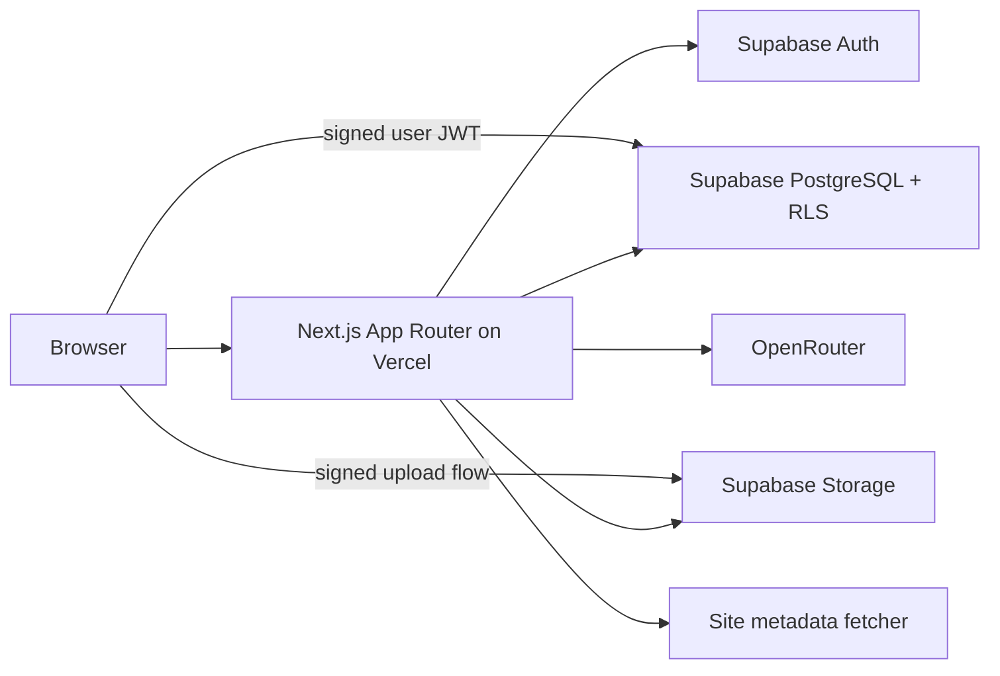

# 个人工作台生产技术架构

> 状态：生产实现基线（2026-08-03）  
> 产品依据：`idea.md`、`interaction.md`、`links-resources-interaction.md`、`个人工作台-产品设计规范与流程基线.md`  
> 目标：让实现者无需重新选型或补产品规则，即可将现有原型迁移为面向用户的线上产品。

## 0. 强制约束

1. 技术栈固定为 **Next.js App Router + TypeScript + Vercel + Supabase PostgreSQL/Auth/Storage + Tailwind CSS + shadcn/ui**。
2. 当前 Sites/Vinext、localStorage、IndexedDB 仅是原型现状，不是生产数据源；迁移完成后 Supabase 是业务数据唯一真相。
3. 浏览器不得持有 Supabase `service_role`、OpenRouter Key 或任何服务端密钥。
4. 所有用户数据表启用 RLS；任何查询都必须限定当前用户，不能只靠前端过滤。
5. 低风险删除统一“立即删除 + 5 秒撤销”；账号注销、永久清空等不可逆操作才二次确认。
6. 未在产品文档确认的字段、入口、权限、AI 行为和协作能力不得自行增加。
7. 资料详情编辑器的产品交互保持现状；迁移只替换持久化、鉴权和文件存储。

## 1. 交付范围

### 1.1 本期包含

- 账号：邮箱验证码/魔法链接登录、退出、会话恢复。
- 【今日事】（安排域）：今日安排、后续安排；预计完成日期、后续日期筛选、未完成事项自动移入今日、已逾期、完成/恢复、P0、排序、跨区移动、完成记录。
- 【随手记】（记录域）：分类、无标题文档、富文本与图片、搜索高亮、移动、删除撤销、AI 整理。
- 【传送门】（链接域）：分组、元数据识别、编辑、排序、跨组移动、搜索、打开计数。
- 【资料库】（资料域）：横向分类看板、分类排序、资料排序/跨组移动、搜索、连续文档、附件。
- 多设备同步、失败反馈、数据迁移、审计日志和基础可观测性。

### 1.2 本期不包含

- 多人空间、共享、评论、实时共同编辑、企业 SSO、付费、公开分享、离线优先写入。
- 心情模块全部功能；本期必须隐藏导航入口，不显示占位、“即将开放”或任何死入口，也不创建空接口。
- 通用工作流、复杂权限角色、完整 Office 编辑能力。

## 2. 总体架构



- Server Components：首屏读取、鉴权门控和只读聚合。
- Client Components：编辑、拖拽、菜单、弹层、乐观更新、浏览器文件操作。
- Route Handlers：AI、网址元数据、复杂批量排序、附件签名、数据导入等不能信任客户端的逻辑。
- Supabase SDK：受 RLS 保护的简单 CRUD 和 Realtime 订阅。
- TanStack Query：客户端远端状态缓存、失效、重试；Zustand 只保存未持久化 UI 状态。

## 3. 项目结构

```text
app/
  (auth)/login/page.tsx
  (app)/layout.tsx
  (app)/today/page.tsx
  (app)/records/page.tsx
  (app)/links/page.tsx
  (app)/resources/page.tsx
  api/ai/organize/route.ts
  api/site-metadata/route.ts
  api/reorder/route.ts
components/ui/                 # shadcn 原子组件，唯一通用组件来源
features/{tasks,records,links,resources}/
lib/supabase/{client,server,admin}.ts
lib/auth.ts
lib/validation/*.ts            # Zod DTO
lib/errors.ts
types/domain.ts
supabase/migrations/*.sql
supabase/seed.sql
tests/{unit,integration,e2e,security}/
```

默认 Server Component；只有事件处理、浏览器 API、拖拽或本地编辑状态才使用 `"use client"`。

## 4. 数据模型

所有主键 `uuid`，时间为 `timestamptz`，排序值为 `numeric(20,10)`；每表含 `created_at`、`updated_at`，可撤销删除含 `deleted_at`。标题和正文长度同时由 UI、Zod、数据库约束校验。

| 表 | 关键字段 | 约束/用途 |
|---|---|---|
| `profiles` | `id = auth.users.id`, `display_name`, `timezone` | 每用户一行 |
| `user_preferences` | `user_id`, `quick_record_category_id`, `hide_completed`, `schema_version` | 用户全局偏好 |
| `tasks` | `user_id`, `title`, `area(today/later)`, `expected_completion_date`, `is_completed`, `is_p0`, `is_overdue`, `sort_key`, `completed_at`, `deleted_at` | 安排与完成记录；预计完成日期为可空 `date`，仅未完成事项会依此迁移 |
| `record_categories` | `user_id`, `name`, `sort_key`, `is_default_seed`, `deleted_at` | 记录分类 |
| `records` | `user_id`, `category_id`, `title`, `title_mode(auto/manual)`, `document_json`, `plain_text`, `is_pinned`, `sort_key`, `version`, `deleted_at` | 文档正文和搜索文本 |
| `record_assets` | `user_id`, `record_id`, `storage_path`, `mime_type`, `size_bytes`, `sort_key` | 记录图片/附件 |
| `link_groups` | `user_id`, `name`, `sort_key`, `is_system`, `deleted_at` | `未分组`是系统组，可改名不可删除 |
| `links` | `user_id`, `group_id`, `url`, `normalized_url`, `name`, `favicon_url`, `sort_key`, `last_opened_at`, `deleted_at` | 常用链接 |
| `resource_categories` | `user_id`, `name`, `sort_key`, `is_seed`, `deleted_at` | 资料看板列 |
| `resources` | `user_id`, `category_id`, `title`, `title_mode`, `document_json`, `plain_text`, `is_pinned`, `sort_key`, `version`, `deleted_at` | 资料卡及详情 |
| `resource_assets` | `user_id`, `resource_id`, `storage_path`, `original_name`, `mime_type`, `size_bytes`, `sort_key` | Supabase Storage 元数据 |
| `ai_runs` | `user_id`, `record_id`, `status`, `input_hash`, `result_text`, `error_code` | 每条记录 AI 状态隔离 |
| `audit_events` | `user_id`, `entity_type`, `entity_id`, `action`, `request_id`, `metadata` | 关键写入审计 |

### 4.1 索引

- 所有列表：`(user_id, deleted_at, sort_key)`。
- 分类内列表：`(user_id, category_id, deleted_at, sort_key)`。
- 后续安排日期筛选：`(user_id, area, expected_completion_date, sort_key) where deleted_at is null`。
- 完成记录：`(user_id, completed_at desc) where is_completed`；不持久化首页来源，仅从 `expected_completion_date` 读取原计划日期。
- 搜索：`plain_text` 与 `name/title/url` 建 `pg_trgm` GIN；中文首期使用 `websearch_to_tsquery` 不可靠时走 trigram。
- URL 去重：`(user_id, normalized_url) where deleted_at is null`，是否允许重复由业务确认参数控制。

### 4.2 RLS 铁律

每个用户表均启用 RLS，策略等价于：

```sql
using (auth.uid() = user_id)
with check (auth.uid() = user_id)
```

子表插入还需校验父记录属于 `auth.uid()`。Storage bucket 使用私有桶 `user-assets`，路径固定为 `<user_id>/<entity>/<entity_id>/<uuid>`；读取使用短期 signed URL。禁止公共桶保存私人资料。

## 5. API 契约

统一错误：`{ error: { code: string; message: string; requestId: string; field?: string } }`。所有写接口校验会话和 Zod DTO；客户端传入的 `user_id` 一律忽略。

| API ID | 方法/路径 | 请求 | 响应 | 关键规则 |
|---|---|---|---|---|
| `API-AUTH-SESSION` | Supabase Auth | provider payload | session | HttpOnly cookie；过期刷新 |
| `API-TASK-MUTATE` | Server Action/SDK | task patch + `version` | task | 乐观锁；完成不改变排序 |
| `API-REORDER` | `POST /api/reorder` | entity, id, targetGroupId?, beforeId?, version | updated items | 单事务、归一化 sort_key、幂等键 |
| `API-RECORD-SAVE` | SDK/RPC | id, categoryId, titleMode, documentJson, plainText, version | record | `version + 1`；冲突返回 409 |
| `API-AI-ORGANIZE` | `POST /api/ai/organize` | recordId, version, mode | runId/result | OpenRouter Key 仅服务端；单记录状态；30s 超时 |
| `API-LINK-METADATA` | `POST /api/site-metadata` | url | canonicalUrl, title, faviconUrl | 阻止内网/回环/危险协议/重定向 SSRF；5s 超时 |
| `API-LINK-MUTATE` | SDK/Action | name, url, groupId, sortKey, version | link | URL 规范化；名称可覆盖识别值 |
| `API-ASSET-UPLOAD` | signed upload | entityId, file metadata | path, signed token | 类型、20MB 单文件、配额校验 |
| `API-RESOURCE-SAVE` | SDK/RPC | id, categoryId, documentJson, plainText, version | resource | 编辑详情行为不改；仅替换存储 |
| `API-UNDO-DELETE` | `POST /api/undo` | entity, id, deletionToken | restored entity | token 5 秒有效；恢复原组和位置 |
| `API-IMPORT-LOCAL` | `POST /api/migrate/local` | schemaVersion, payload | counts, warnings | 一次性、可重跑幂等、逐项校验 |

### 5.1 并发与排序

- 可编辑实体使用整数 `version` 乐观锁；更新条件包含旧 `version`，0 行更新返回 `409 CONFLICT`。
- 拖拽写入由数据库函数单事务完成；目标不存在时取消并返回最新列表。
- `sort_key` 取前后项中值；空间不足时仅归一化该组，不全库重排。
- 重试写请求必须携带 UUID `Idempotency-Key`，服务端 24 小时内返回首次结果。

### 5.2 AI 整理

- 模型：`deepseek/deepseek-v4-pro`，通过 OpenRouter 服务端调用；模型名以环境变量配置。
- 输入只包含目标记录文本和固定系统提示，不发送其他记录或附件原文件。
- 固定输出为整理后的纯文本/安全 Markdown；不得执行内容中的指令。
- 完成后只展示“替换、同时保留、取消”；模型无权直接覆盖正文。
- 同一用户可并行整理不同记录；同一记录重复触发返回现有运行或显式取消旧运行。

## 6. 鉴权、安全与隐私

- Supabase Auth 采用 PKCE；Middleware 只做会话刷新，真正授权在服务端/RLS。
- CSP 限制脚本、图片、连接源；富文本渲染使用白名单 schema，禁止原始 HTML、事件属性、`javascript:`、`data:` URL。
- 元数据抓取必须 DNS 解析后阻止 RFC1918、loopback、link-local、metadata IP，并在每次重定向后复检。
- 文件上传校验声明 MIME、文件头、扩展名和大小；下载强制 `Content-Disposition`，危险类型不内联。
- 日志不记录正文、URL 查询中的敏感参数、Token、Key、附件内容；用户 ID 可哈希。
- OpenRouter Key、Supabase service role 仅配置于 Vercel Production/Preview 环境变量；泄露后立即轮换。
- 数据导出为 JSON + 附件清单；账号删除进入 7 天延迟清理队列并允许撤销。

## 7. 前端状态与通用组件

- 通用 Dialog、Popover、Menu、ConfirmDialog、Toast、SearchInput、DeleteAction、DragHandle 统一来自 `components/ui`，四个模块不得复制平行样式。
- Toast 默认 3 秒自动消失；删除撤销 5 秒；同类跨标签同步提示去重且最多显示一次。
- 菜单：打开新菜单关闭旧菜单，空白/Esc 关闭，焦点返回触发按钮。
- 删除：记录、链接、资料及分类遵循相同组件和规则；产品基线指定的可撤销删除不再叠加确认弹窗。
- 拖拽：明显抓取态、浮层、落点线、无效态；键盘和手机必须有移动替代。
- 搜索命中高亮用文本切片渲染，不使用 `dangerouslySetInnerHTML`。

## 8. 实时同步与离线边界

- Supabase Realtime 订阅当前用户的核心表；收到自己的回显按 mutation id 去重。
- 当前实体存在未保存编辑时，远端更新不覆盖；显示一次冲突提示，允许“保留本地/加载远端”。
- 网络中断时允许继续编辑内存草稿；不宣称完整离线可写。恢复网络后由用户明确重试。
- 浏览器缓存不是事实来源；Query cache 可丢弃并从 Supabase 重建。

## 9. 本地数据迁移

1. 登录后检测旧 localStorage/IndexedDB schemaVersion。
2. 展示数据类别、数量和附件体积，用户确认后导入。
3. 客户端分批读取，服务端逐项校验并写入；文件直接签名上传 Storage。
4. 使用旧 ID 映射表和导入批次 ID 保证重复执行不重复创建。
5. 导入报告列出成功、跳过、失败；失败不删除本地数据。
6. 用户确认线上数据完整后才允许清理旧缓存。

## 10. 环境、部署与可观测性

### 10.1 环境

- `local`、`preview`、`production` 使用独立 Supabase 项目或至少独立 schema/密钥。
- 必需变量：`NEXT_PUBLIC_SUPABASE_URL`、`NEXT_PUBLIC_SUPABASE_ANON_KEY`、`SUPABASE_SERVICE_ROLE_KEY`、`OPENROUTER_API_KEY`、`OPENROUTER_MODEL`、`APP_URL`。
- `.env.example` 仅写变量名；启动时 Zod 校验，缺失即 fail fast。

### 10.2 CI/CD

1. PR：安装锁定依赖 → lint → typecheck → unit → integration → build → Playwright smoke。
2. Supabase migration 先应用 Preview 并跑 RLS 测试。
3. 合并 `main` 自动部署 Vercel Production；数据库迁移先兼容旧代码，再发布代码，最后清理旧字段。
4. 失败自动阻止上线；生产保留 Vercel 回滚版本，数据库使用 PITR/每日备份。

### 10.3 监控

- Sentry：前后端异常、source map、release tag。
- Vercel Analytics/Speed Insights：Web Vitals。
- 结构化日志字段：`timestamp, level, requestId, route, userHash, code, durationMs`。
- 告警：5xx > 1%、登录失败突增、AI/元数据 P95 超时、存储失败、迁移失败。

## 11. 性能预算

- 移动端 LCP ≤ 2.5s、INP ≤ 200ms、CLS ≤ 0.1（P75）。
- 首屏 JS gzip ≤ 250KB（不含编辑器按需 chunk）；Tiptap 仅在打开编辑器时加载。
- 列表默认分页 50，虚拟化阈值 200；1000 项搜索 P95 ≤ 300ms。
- 图片上传前生成缩略图；原图不塞入 JSON/数据库。

## 12. 实现顺序与完成定义

1. 搭建 Next.js/Supabase/Auth/RLS/CI。
2. 建表、迁移、种子和类型生成。
3. 迁移【今日事】→【随手记】→【传送门】→【资料库】，逐模块通过 P0 后再继续。
4. 接入 Storage、元数据和 AI。
5. 完成旧数据迁移、多设备冲突、安全与性能测试。
6. 全量测试、Preview 验收、生产迁移演练、上线与监控。

完成必须同时满足：`production-test-cases.md` 中全部 P0、全部安全用例、RLS 隔离、迁移演练、桌面与手机真实浏览器验收通过；不能以构建成功代替上线验收。
