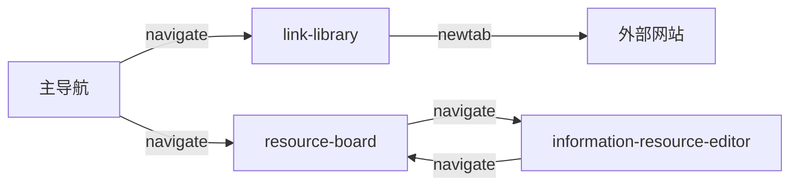

# 【链接／资料】交互文档

> 对齐：`docs/idea.md` @ 2026-08-02（链接／资料拆分版）
> 角色：本地个人版用户；本轮不引入账号、共享和多人权限。
> 范围：`link-library` 与 `resource-board` 两个页面；现有资料编辑详情沿用 `docs/interaction.md`，不修改。

## A. 全局信息架构

### A.1 页面清单

| 页面 ID | 页面名称 | 导航入口 | 目的 |
|---|---|---|---|
| `link-library` | 链接 | 桌面左侧／手机底部“链接” | 分组、查找、排序并快速打开网页链接 |
| `resource-board` | 资料 | 桌面左侧／手机底部“资料” | 以横向分类看板浏览、创建、排序和移动资料 |
| `information-resource-editor` | 资料编辑详情 | 点击资料卡片 | 编辑一张连续文档；规则见 `docs/interaction.md` |

原【信息】导航删除，数据迁移后分别进入【链接】和【资料】；不得同时保留旧入口。

### A.2 导航与跳转

- 桌面左侧导航顺序：安排、记录、链接、资料、心情。
- 手机底部导航顺序相同；五项等宽，不横向滚动。
- 页面切换保留各自搜索词、筛选、排序、视图模式和滚动位置。
- 全局 `toast` 最多堆叠 3 条，默认 3 秒；删除撤销为 5 秒。

### A.3 全局状态与可访问性

- 本地存储加载期间使用结构骨架，不闪现空数据。
- 多标签页检测到另一标签修改时显示非阻断提示；用户确认刷新前不覆盖当前编辑。
- 所有图标按钮有可访问名称；桌面可视控件可小于 44px，但实际热区不小于 40px，移动端不小于 44px。
- 菜单、弹层按 `Esc` 或点击外部关闭；关闭后焦点返回触发元素。
- 拖拽不是唯一入口，所有排序和移动均提供菜单替代。
- `prefers-reduced-motion` 下取消拖拽位移动画，仅保留位置更新。

## B. `link-library` 链接页面

### B.1 页面规格

| 字段 | 内容 |
|---|---|
| 页面 ID | `link-library` |
| 入口 | 主导航“链接” |
| 出口 | 点击链接在浏览器新标签打开；主导航切换其他模块 |
| 桌面布局 | 顶部工具栏＋横向分组筛选＋链接内容区 |
| 手机布局 | 顶部搜索＋横向分组标签＋单列内容；行级操作进入底部动作面板 |

### B.2 页面状态

| 状态 | 触发 | 呈现与恢复 |
|---|---|---|
| `loading` | 读取链接、分组和偏好 | 工具栏保留，内容区显示 6 行骨架 |
| `empty` | 没有任何链接 | 文案“还没有常用链接”＋`link-library-E-A-03` 新增按钮 |
| `error` | 本地数据损坏或读取失败 | 错误说明＋“恢复可用数据”；不覆盖可恢复内容 |
| `forbidden` | 本地个人版不存在权限差异 | 不进入该状态；未来在线版无权时显示锁定说明并返回安排页 |
| `search-empty` | 搜索无匹配 | 内容区显示“没有匹配链接”，保留搜索框和清除按钮 |
| `offline` | 断网 | 已保存链接仍可管理；网站识别失败使用域名后备并 `toast` 提示 |

### B.3 模块与元素

#### `link-library-M-A` 顶部工具栏

| 元素 ID | 元素 | 类型与行为 |
|---|---|---|
| `link-library-E-A-01` | 搜索 | 输入框；搜索名称、网址和分组，300ms 防抖，结果关键词高亮；无层级变化 |
| `link-library-E-A-02` | 视图切换 | 图标按钮组；列表／网格即时切换并保存偏好；无层级变化 |
| `link-library-E-A-03` | 新增链接 | 次强度“＋”按钮；打开新增表单【呈现方式：`modal`】 |
| `link-library-E-A-04` | 排序 | 轻量文字按钮“排序：手动”；打开选项【呈现方式：`popover`】 |

排序选项：手动、最近打开、最近添加、名称 A–Z。仅“手动”允许拖拽；切换其他排序后拖拽禁用并通过 `popover` 说明原因。排序按钮使用白底／透明底文字样式，不使用紫色实底。

#### `link-library-M-B` 分组筛选

| 元素 ID | 元素 | 类型与行为 |
|---|---|---|
| `link-library-E-B-01` | “全部” | 激活后显示所有链接；不可删除或排序 |
| `link-library-E-B-02` | “未分组” | 显示没有自定义分组的链接；不可删除 |
| `link-library-E-B-03` | 自定义分组标签 | 点击筛选；拖拽调整分组顺序；操作菜单【呈现方式：`popover`】 |
| `link-library-E-B-04` | 新建分组 | 打开单字段表单【呈现方式：`modal`】 |

- 自定义分组名称 1～40 字，去除首尾空格，不允许重名。
- 删除空分组走【呈现方式：`confirm`】；删除非空分组时明确显示其中链接数量，确认后链接迁移至“未分组”。
- 分组超过可见宽度时横向滚动，最后保留“更多”入口；不换成多行。

#### `link-library-M-C` 链接内容区

| 元素 ID | 元素 | 类型与行为 |
|---|---|---|
| `link-library-E-C-01` | 链接行／图标项 | 点击在新标签打开【呈现方式：`newtab`】；写入最近打开时间 |
| `link-library-E-C-02` | 链接操作 | 编辑、移动分组、删除【呈现方式：桌面 `popover`／手机 `bottomsheet`】 |
| `link-library-E-C-03` | 拖拽手柄 | 手动排序时可用；拖拽完成立即写入排序值 |

新增链接行为序列：打开 `modal` → 输入网址 → 自动识别名称和 Logo → 名称字段自动填充且可编辑 → 保存。网址必填且仅允许 `http/https`；名称 1～200 字。识别失败不阻止保存，使用域名和稳定后备图标。

编辑链接复用同一表单，允许同时修改名称、网址和分组。删除立即执行并显示 5 秒撤销 `toast`，不弹重复确认。

### B.4 数据需求

| 数据需求 | 时机 | 失败回退 |
|---|---|---|
| 读：全部链接、分组、排序值、最近打开时间、视图和排序偏好 | 进入页面 | `error` 或恢复可用数据 |
| 写：新增／编辑／删除链接，移动分组和排序 | 对应操作完成 | 回滚操作＋`toast` |
| 写：新增／重命名／删除／排序分组 | 分组管理 | 回滚＋`toast` |
| 写：视图、排序和当前分组偏好 | 用户切换 | 保持当前会话状态并提示未持久化 |

## C. `resource-board` 资料页面

### C.1 页面规格

| 字段 | 内容 |
|---|---|
| 页面 ID | `resource-board` |
| 入口 | 主导航“资料”；资料编辑器返回 |
| 出口 | 点击资料卡片进入 `information-resource-editor`【呈现方式：`navigate`】 |
| 桌面布局 | 顶部工具栏＋横向分区看板；分类固定宽度，列内独立滚动 |
| 手机布局 | 顶部分类标签切换，一次显示一列；不要求横向拖动看板 |

### C.2 页面状态

| 状态 | 触发 | 呈现与恢复 |
|---|---|---|
| `loading` | 读取分类、资料和排序 | 显示 3 列骨架，每列 4 张卡片 |
| `empty` | 没有分类或资料 | 保留预置分类；空列显示简短文案，新增按钮始终固定在列头 |
| `error` | 本地数据损坏或读取失败 | 看板显示错误区域＋恢复可用数据，不进入编辑器 |
| `forbidden` | 本地个人版不存在权限差异 | 不进入该状态；未来在线版无权时显示锁定说明 |
| `search-empty` | 搜索无匹配 | 切换统一结果列表并显示“没有匹配资料” |
| `offline` | 断网 | 本地资料完整可用；不影响新增、编辑、移动和排序 |

### C.3 模块与元素

#### `resource-board-M-A` 顶部工具栏

| 元素 ID | 元素 | 类型与行为 |
|---|---|---|
| `resource-board-E-A-01` | 搜索 | 输入框；匹配标题、正文、链接域名和文件名，300ms 防抖并高亮；无层级变化 |
| `resource-board-E-A-02` | 排序 | 轻量文字按钮“排序：手动”，位于搜索框右侧或列标题区域上方；打开选项【呈现方式：`popover`】 |
| `resource-board-E-A-03` | 新建分类 | 边框图标按钮；打开单字段表单【呈现方式：`modal`】 |

排序入口不是紫色主按钮。默认采用灰紫文字＋下箭头，无填充、无渐变；展开时才显示浅紫背景。选项为手动、更新时间、名称。排序对当前所有列生效并保存偏好。

#### `resource-board-M-B` 横向分区看板

| 元素 ID | 元素 | 类型与行为 |
|---|---|---|
| `resource-board-E-B-01` | 分类列 | 桌面固定宽 288～320px；列标题固定，资料区独立纵向滚动 |
| `resource-board-E-B-02` | 固定新增按钮 | 位于列标题右侧，始终可见；创建后进入现有编辑详情【呈现方式：`navigate`】 |
| `resource-board-E-B-03` | 分类操作 | 重命名、移动列、删除【呈现方式：桌面 `popover`／手机 `bottomsheet`】 |
| `resource-board-E-B-04` | 资料卡片 | 展示标题、单行摘要、更新时间和置顶；点击进入详情【呈现方式：`navigate`】 |
| `resource-board-E-B-05` | 资料操作 | 置顶、移动分类、删除【呈现方式：桌面 `popover`／手机 `bottomsheet`】 |
| `resource-board-E-B-06` | 列拖拽 | 拖动列标题调整分类顺序；完成后写排序值 |
| `resource-board-E-B-07` | 卡片拖拽 | 手动排序时支持列内排序和跨列移动；完成后写分类与排序值 |

- 看板横向滚动只作用于看板区域，页面本身不产生横向溢出。
- 列头、分类名、数量、新增和操作按钮固定；卡片列表滚动时不得消失。
- 新增按钮不放在列尾，空列也只在列头保留同一入口。
- 拖到横向边缘时自动滚动；拖到长列上下边缘时只滚动目标列。
- 搜索激活后，看板切换成统一结果列表，保留资料所属分类标识；清空搜索恢复原看板与滚动位置。
- 手动排序外的其他排序模式禁用卡片拖拽；跨列移动仍可通过资料操作菜单完成。
- 删除空分类走 `confirm`；删除非空分类必须选择迁移目标后再 `confirm`。至少保留一个资料分类。
- 点击卡片进入详情前记录看板横向位置、列内滚动位置和焦点；返回后完整恢复。

### C.4 数据需求

| 数据需求 | 时机 | 失败回退 |
|---|---|---|
| 读：全部分类、资料摘要、置顶、排序值、更新时间和页面偏好 | 进入页面／返回详情 | `error` 或恢复可用数据 |
| 写：新增／重命名／删除／排序分类 | 分类操作 | 回滚＋`toast` |
| 写：新增资料、置顶、删除、列内排序和跨列移动 | 卡片操作 | 回滚卡片原位置＋`toast` |
| 写：排序偏好、横向位置和各列滚动位置 | 用户操作／进入详情前 | 无法保存时保持当前会话状态 |

## D. 边界与异常

| 场景 | 链接 | 资料 |
|---|---|---|
| 0／1／1000 项 | 空态可新增；长列表内部滚动 | 空列仍有固定新增；长列独立滚动并保持拖拽流畅 |
| 超长名称 | 列表单行省略，悬停 `popover` 全文 | 标题最多两行，摘要一行，不挤压操作按钮 |
| 重名 | 允许同名链接 | 允许同名资料；分类禁止重名 |
| 快速重复操作 | 新增、保存、删除锁定防重复 | 新增、跨列移动和删除锁定防重复 |
| 多标签冲突 | 提示另一标签已修改，不静默覆盖 | 同左；详情编辑优先保护未保存内容 |
| 200% 缩放 | 列表仍可操作，操作收进菜单 | 看板允许横向滚动，列宽不压缩到不可读 |
| 手机排序 | 操作菜单提供上移／下移和移动分组 | 操作菜单提供移动列、移动资料和置顶替代 |

## E. 验收标准

1. 主导航中【链接】和【资料】完全替代【信息】。
2. 链接支持分组、搜索、高亮、排序、跨组移动、列表／网格切换和偏好恢复。
3. 资料分类横向排列、固定列宽、列内独立滚动；新增按钮始终固定在列头。
4. 资料排序入口为轻量文字菜单，不出现突兀的紫色实底按钮。
5. 搜索资料时使用统一结果列表，清空后恢复看板位置。
6. 桌面拖拽和手机菜单替代均能完成排序与跨分类移动。
7. 刷新、长列表、1000 项、200% 缩放和多标签冲突均有明确结果。
8. 点击资料继续进入现有编辑详情，详情页功能和数据不被本轮改变。
